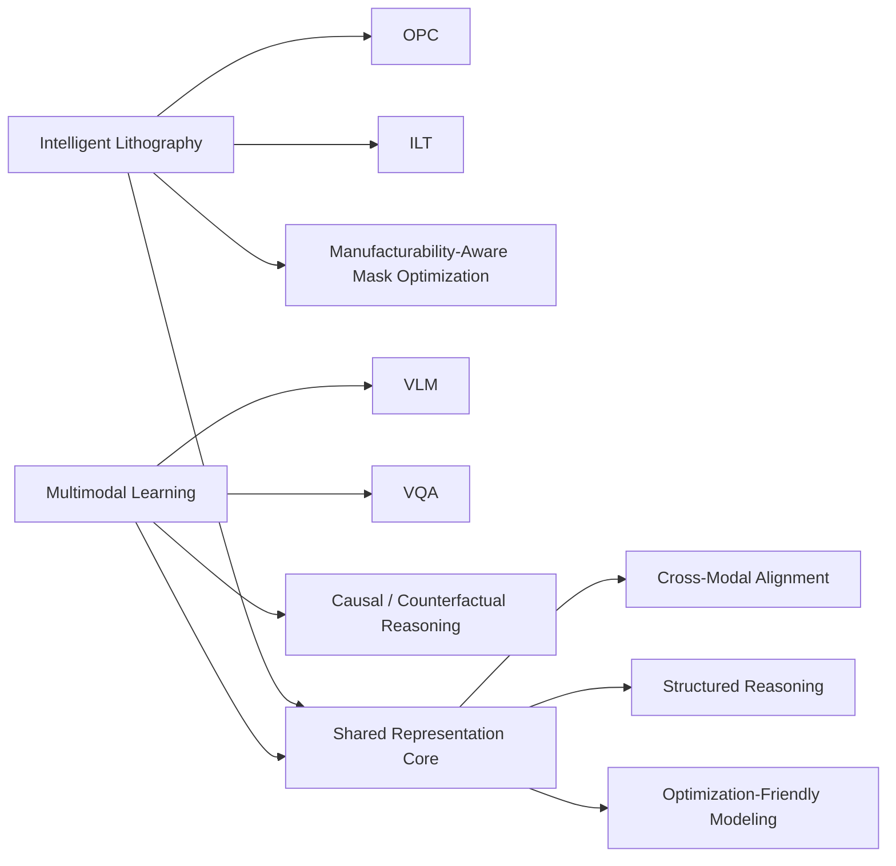

  

 

  
  
  <!-- Replace the link below with your actual Google Scholar URL when ready -->
  <!--  -->

---

## System Initialization // Research Identity

I am **Xia Ye**, a **Ph.D. student at ShanghaiTech University**, working at the intersection of **Computational Lithography** and **Multimodal Learning**.

My current research focuses on two tightly coupled directions:

- **Intelligent Lithography**: Optical Proximity Correction, Inverse Lithography Technology, mask optimization, manufacturability-aware geometry representation, and differentiable rendering for mask synthesis.
- **Multimodal Learning**: Vision-Language Models, Visual Question Answering, causal reasoning, counterfactual reasoning, and structured scene understanding.

I am particularly interested in building representations that are not only accurate, but also **interpretable, optimization-friendly, and physically grounded**.

---

## Runtime Status // Active Modules

- **Currently Building**
  - Manufacturability-aware OPC and ILT pipelines
  - Primitive-based mask optimization and differentiable geometry rendering
  - VLM-based reasoning frameworks for structured visual understanding

- **Core Keywords**
  - `Computational Lithography`
  - `Optical Proximity Correction`
  - `Inverse Lithography Technology`
  - `Vision-Language Models`
  - `Visual Question Answering`
  - `Causal Inference`
  - `Counterfactual Reasoning`
  - `Scene Understanding`

---

## Research Graph // Active Directions

**Architecture view**
- The **lithography track** emphasizes geometry, physics, manufacturability, and optimization stability.
- The **multimodal track** emphasizes representation learning, semantic reasoning, and cross-modal alignment.
- The **shared core** is where I try to connect low-level structure with high-level reasoning.

---

## Tech Stack // Research Environment

  

---

## Public Nodes // Featured Repositories

| Repository | Description |
| :--- | :--- |
| **[DiffOPC](https://github.com/LucidX2002/DiffOPC)** | Differentiable OPC experiments and implementation work related to computational lithography. |
| **[NJAU_CS](https://github.com/LucidX2002/NJAU_CS)** | Study materials and course resources collected during undergraduate training. |
| **[LucidX2002](https://github.com/LucidX2002/LucidX2002)** | Configuration repository for this GitHub profile. |

---

## Telemetry Data // GitHub Stats

  
  

---

## Signal Channel // Contact

- **Email**: yxialucid@gmail.com
- **GitHub**: [LucidX2002](https://github.com/LucidX2002)
- **Location**: Shanghai, China

---

## Boot Log // Closing Statement

I use GitHub as a public notebook for research engineering, algorithm prototyping, and system-level experimentation.

If your interests overlap with **Computational Lithography**, **Multimodal Learning**, or **Vision-Language Reasoning**, feel free to connect.
