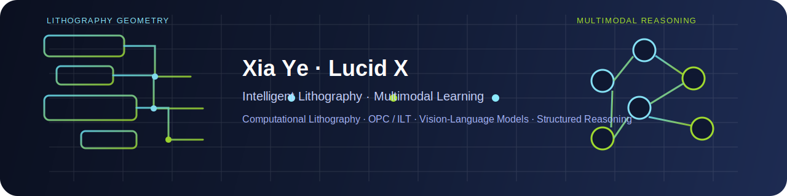
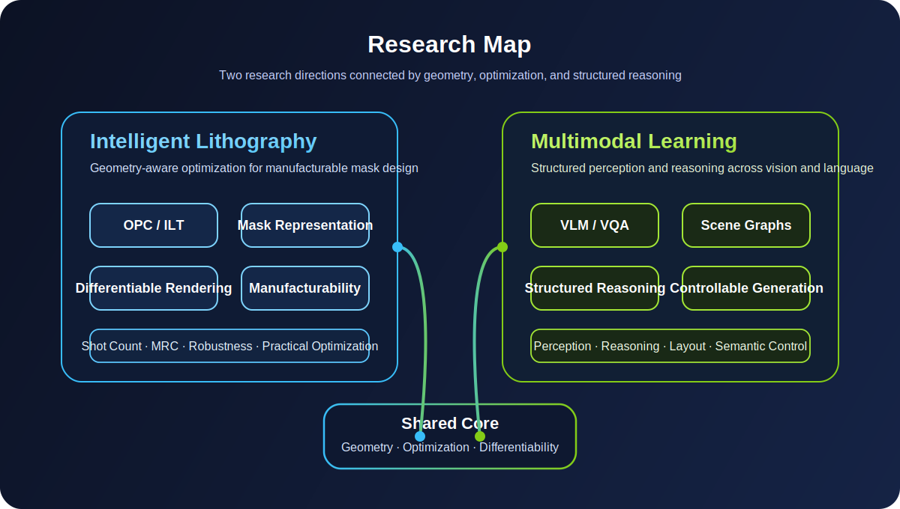

  

<h1 align="center">Xia Ye | Lucid X</h1>

  Ph.D. student at ShanghaiTech University 
  Intelligent Lithography · Multimodal Learning · Research Engineering

  <a href="https://github.com/LucidX2002">GitHub</a>

---

## About Me

I am a Ph.D. student at ShanghaiTech University, working at the intersection of **Intelligent Lithography** and **Multimodal Learning**.

My research interests include:

- **Computational Lithography**: OPC, ILT, differentiable mask optimization, manufacturability-aware constraints
- **Geometry-aware Optimization**: mask representation, differentiable rendering, design-for-manufacturing
- **Multimodal Learning**: Vision-Language Models, Visual Question Answering, scene graph reasoning
- **Controllable Generation**: structured image generation, semantic layout, and reasoning-guided generation

## Research Map

  

## Current Focus

- Building practical optimization pipelines for **OPC / ILT**
- Exploring **geometry-aware representations** for lithography-friendly mask design
- Studying **VLM / VQA** systems with structured visual reasoning
- Connecting **optimization**, **geometry**, and **multimodal intelligence** for real-world applications

## Selected Repositories

- [DiffOPC](https://github.com/LucidX2002/DiffOPC)
  DiffOPC implementation with engineering fixes and experiments for computational lithography.

- [NJAU_CS](https://github.com/LucidX2002/NJAU_CS)
  A curated collection of learning materials from NJAU Computer Science.

## Toolbox

`Python` `PyTorch` `CUDA` `OpenCV` `Linux` `Git` `Jupyter` `LaTeX`

## Research Keywords

`OPC` `ILT` `Computational Lithography` `Differentiable Rendering` `Manufacturability` 
`VLM` `VQA` `Scene Graph` `Multimodal Reasoning` `Controllable Generation`

## Collaboration

I am interested in research and engineering collaborations related to:

- Computational Lithography
- Multimodal Perception and Reasoning
- Structured Visual Understanding
- Reproducible Research Systems

## Contact

- GitHub: [@LucidX2002](https://github.com/LucidX2002)

<!--
Optional dynamic widgets can be added later.
See OPTIONAL_WIDGETS.md for third-party stats cards and typing SVG snippets.
-->
